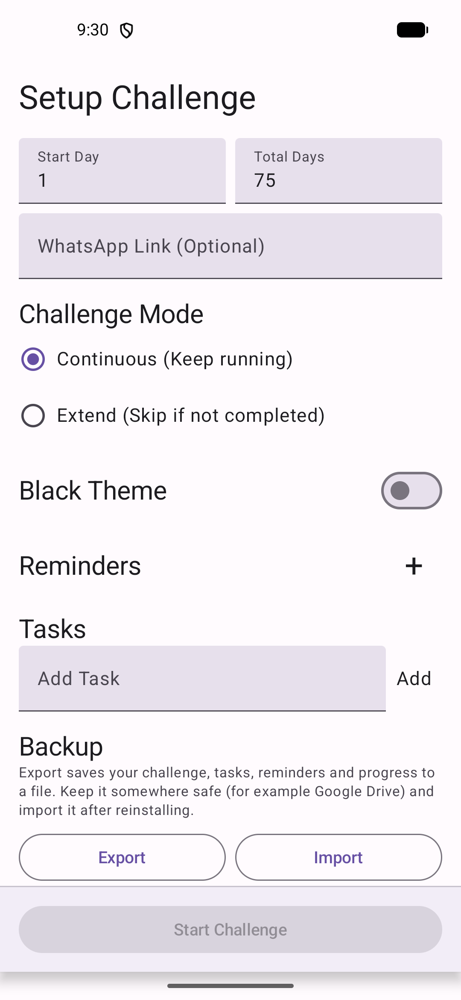
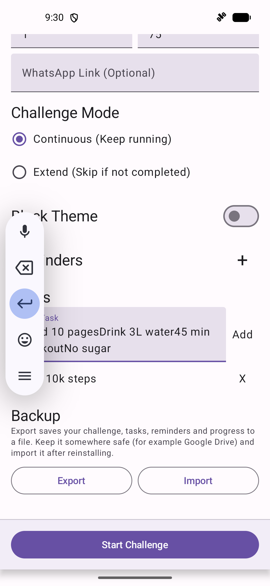
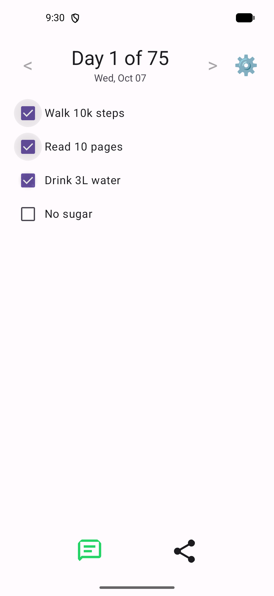
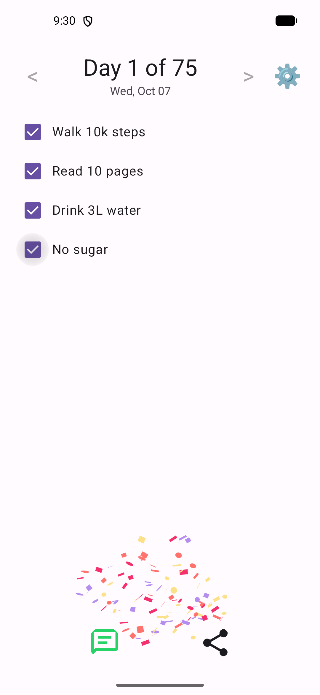
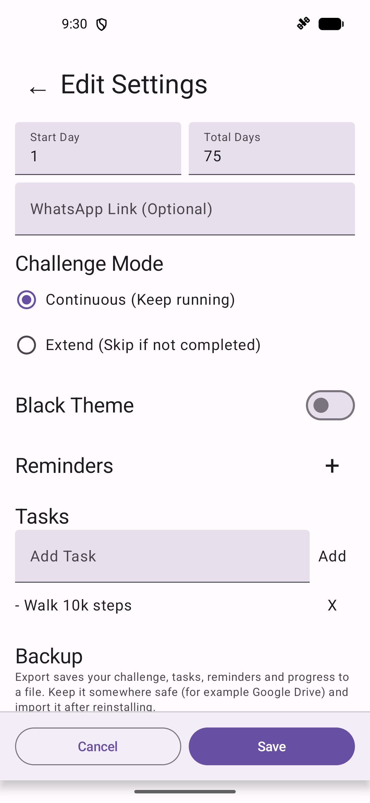
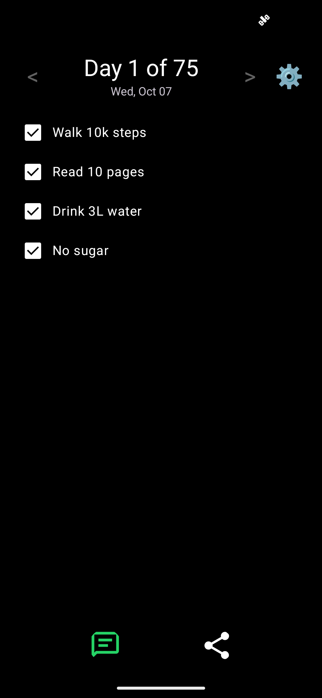
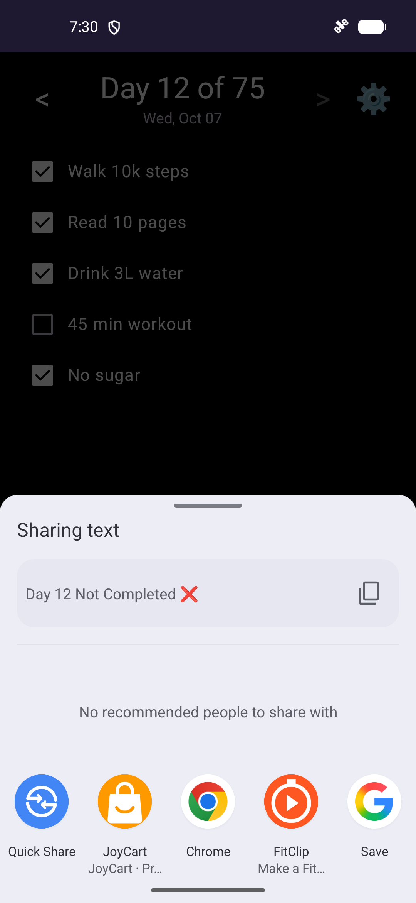

# Tasky — 75-day challenge tracker (Android)

> [!WARNING]
> **For educational purposes and individual use only.** Tasky is a personal learning project, provided as-is with no warranty and no support. It is not health or medical advice. Read the [Disclaimer](DISCLAIMER.md) before installing.

Tasky helps you stick to a daily habit challenge. The default is 75 days, and you can choose any length.

This repository only publishes signed APKs. The source code is maintained privately, and every release here is built and uploaded automatically by CI.

## Screens

| Set up your challenge | Your daily tasks | Today in progress |
| :---: | :---: | :---: |
|  |  |  |
| **All tasks done** | **Edit settings any time** | **True-black theme** |
|  |  |  |
| **Share your status** | | |
|  | | |

## Use cases

**Start a 75-day challenge from scratch.** Enter your daily rules as tasks (for example *Walk 10k steps*, *Read 10 pages*, *Drink 3L water*, *45 min workout*, *No sugar*), leave Total Days at 75, and tap **Start Challenge**. Each day opens on today's checklist, headed "Day N of 75".

**Bring an existing challenge over from another tracker or a notebook.** If you're already on day 12, set **Start Day** to 12. Tasky picks up from there and counts forward, so you don't lose your streak by switching apps.

**Build a habit that isn't 75 days long.** Set **Total Days** to 21, 30, 66, 100, or anything else. When you pass the last day, the app shows **Challenge Completed!**

**Choose how strict a missed day is.**
- **Continuous** follows the calendar: day 12 is always 11 days after you started, whether or not you finished your tasks. The ✅/❌ record keeps you honest. This suits "track it, don't reset it" challenges.
- **Extend** only moves to the next day once every task is ticked. Miss a day and you repeat it tomorrow, so 75 completed days might take 80 calendar days. This suits "every day must count" challenges.

You can switch modes mid-challenge in settings, and the day you've reached is kept.

**Stay accountable to a group.** Tap the WhatsApp button to send "Day 12! ✅" or "Day 12 Not Completed ❌" to your challenge group, or use the share button to send it through any other app (Telegram, Signal, SMS, email).

**Get nudged before the day slips away.** Add one or more reminders, for example 07:30 to plan the day and 21:00 to finish up. Each reminder tells you how many tasks are left, or that you're done and can share.

**Look back at past days.** Use **<** and **>** to step through previous dates and see which tasks you ticked. Past days are read-only, so history can't be edited after the fact.

**Change the plan as you go.** Open ⚙️ to add or remove tasks, change reminders, switch the theme, or reset the challenge. Resetting keeps your task list, so you can restart the same challenge with one tap.

**Keep your progress when you change or reset your phone.** Before uninstalling, switching phones, or doing a factory reset, open ⚙️ → **Backup** → **Export** and save the file somewhere safe, such as Google Drive. After reinstalling, tap **Import** on the first screen and pick that file. Your tasks, reminders, mode, theme, and every day's ticks come back, and you're on the same day of the challenge.

**Track late at night without the glare.** Turn on **Black Theme** for a true-black screen that's easy on the eyes and saves battery on OLED phones.

## Download

Get the latest `Tasky-<version>.apk` from **[Releases](../../releases/latest)**.

1. Open the APK on your Android phone (Android 7.0 or newer).
2. If prompted, allow your browser or file manager to **install unknown apps**.
3. Install, then open **Task75**.

Android shows an "unknown app" warning because the APK doesn't come from the Play Store. Only install APKs from this repository's Releases page.

## Features

- Pick the challenge length and the day to start from (useful when moving mid-challenge from another tracker).
- Define your own list of daily tasks and tick them off each day.
- Two modes:
  - **Continuous**: the day counter moves forward every calendar day.
  - **Extend**: the counter only moves forward once every task for the current day is done, so missed days extend the challenge.
- Browse previous days to review your history.
- Several daily reminder notifications.
- One-tap sharing of "Day X ✅/❌" to WhatsApp or any app.
- Light and true-black (OLED) themes.
- Export your whole challenge to a backup file and import it after a reinstall or on a new phone.
- Everything is stored on your device. There is no account, server, analytics, or ads.

## Versions

Releases use `MAJOR.MINOR.PATCH.BUILD` (for example `0.0.0.7`). The last number goes up on every published build.

## License

[MIT](LICENSE). See also the [Disclaimer](DISCLAIMER.md).
